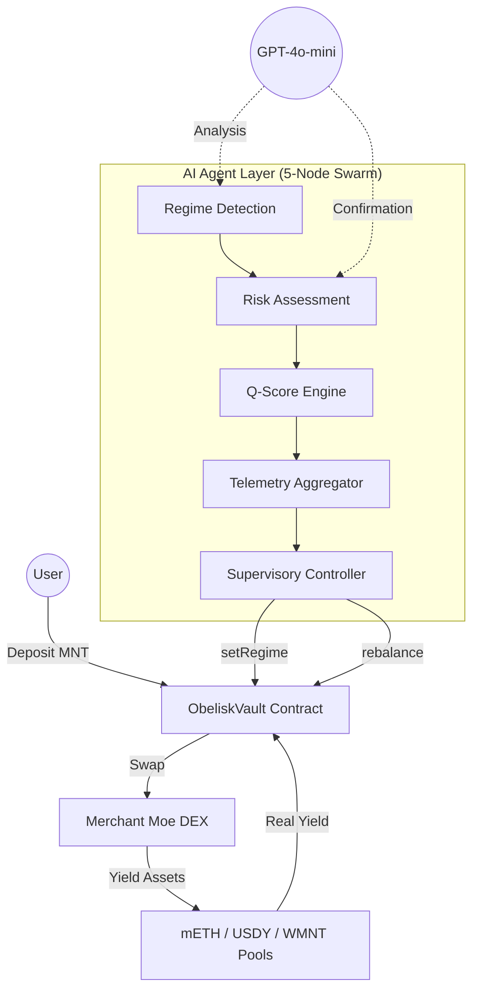

# Obelisk Q — Autonomous Wealth Intelligence on Mantle

**Obelisk Q** is the first autonomous wealth navigator optimized for Mantle Mainnet. It leverages a specialized 5-node LangGraph architecture to provide institutional-grade yield optimization across mETH and USDY (RWA), protected by a real-time autonomous circuit breaker.

---

## 🏆 Hackathon Submission: AI & RWA Track

Obelisk Q is submitted to the **AI & RWA Track** (Application Path) and is competing for the **Grand Champion** title.

### 📝 The Pitch: Bringing Intelligence to RWAs
*   **Asset Category**: Real World Assets (USDY - US Treasury backed), Liquid Staking Tokens (mETH), and Wrapped MNT (WMNT).
*   **The AI Role**: A 5-node autonomous swarm (LangGraph) acts as a "Sovereign Navigator," detecting market regimes and rebalancing capital between stable RWA yield, stable Mantle yield (WMNT), and aggressive staking growth without human intervention.
*   **Mantle Integration**: Deeply integrated with the Mantle Ecosystem (mETH + USDY). Deployed and verified on **Mantle Mainnet**.

### 🛠️ Technical Excellence & Deployment
### 🏛️ Sovereign Swarm Architecture
Obelisk Q operates a **Multi-Node Agent Swarm** designed for 100% uptime and mathematical certainty:
*   **Autonomous Leader Election**: If the primary VM fails, a shadow node automatically promotes itself to maintain vault supervision.
*   **Hybrid Consensus Voting**: Every rebalance is validated by both a GPT-4o reasoning engine and a deterministic mathematical analyst.
*   **Trend-Locked Rebalancing (Anti-Whipsaw)**: Enforces a 3-cycle stability window to minimize gas burn and slippage during market noise.
*   **Yield Auto-Compounding**: Native `compound()` logic harvests MNT rewards and re-invests them back into the target yield position.

### 🏦 Core Protocol Details (Mantle Mainnet)
*   **ObeliskVault**: `0x2e7D0D1642Faf1b2FCb433597c34252d8c7F11bB`
*   **ERC-8004 Agent ID**: `0x5698E89Ec2396e02679ddde33c2BA78de88F7fce`
*   **Network**: Mantle Mainnet (Chain ID 5000)
*   **Primary Assets**: mETH (Staking), USDY (RWA), WMNT (Liquidity)

*   **USDY (Ondo RWA)**: `0x8D6857216076fb05316B3C068694086E6689799c`
*   **mETH (Mantle LSP)**: `0xcDA86A272531e8640cD7F1a92c01839911B90bb0`
*   **WMNT (Wrapped MNT)**: `0x78c1b0C915c4FAA5FffA6CAbf0219DA63d7f4cb8`
*   **Network**: Mantle Mainnet (Chain ID: 5000)

---

## 🏗️ System Architecture

### 1. The Autonomous Swarm (Backend)
The "brain" of the system operates on a specialized 5-node LangGraph feedback loop:
*   **Regime Detection**: Scans liquidity markers and yield vectors (mETH, USDY, WMNT) on Mantle.
*   **Risk Assessment**: Executes a "Regime Audit" using Hidden Markov Models to classify markets as Expansion, Consolidation, or Contraction.
*   **Q-Score Engine**: Calculates institutional-grade stability ratings (0-100) based on volatility and depth.
*   **Telemetry Aggregator**: Synchronizes state across agent nodes using the Antigravity Protocol (<500ms latency).
*   **Supervisory Controller**: The authorized on-chain actor that signs and triggers execution on Mantle.
*   **HA Shadow Nodes**: Implements a "Hot Standby" architecture where secondary nodes monitor primary health and take over execution in case of failure.

### 3. GPT-4o-mini Intelligence Layer (Azure OpenAI)
The agent swarm is augmented by **GPT-4o-mini** via Azure OpenAI, providing real-time AI reasoning at two critical decision points:
*   **Market Analysis** (`regime_detection_node`): Analyzes real-time DeFiLlama yield data (mETH/USDY APY), CoinGecko price movements (MNT 24h change), ETH volatility, and the Fear & Greed Index to produce a 1-sentence market outlook each cycle.
*   **Regime Confirmation** (`risk_assessment_node`): After the rule-based HMM computes a raw regime signal, GPT-4o-mini acts as a second opinion — confirming or overriding the regime classification (Expansion / Consolidation / Contraction) based on the full market context.
*   **Graceful Fallback**: If the LLM call fails (network issue, rate limit, timeout), the agent automatically falls back to pure rule-based logic with zero downtime. The system never stalls waiting for AI.

### 4. Institutional Safeguards & Technical Excellence
*   **Deterministic Slippage Guard (Anti-MEV)**: The agent now utilizes a **Dynamic Slippage Engine** that adjusts its tolerance (0.5% to 2.5%) based on market volatility and regime, ensuring execution success even during flash crashes.
*   **Dynamic Asset Registry**: The vault is no longer limited to hardcoded tokens. The owner can add or remove any Mantle-native assets (mETH, USDY, FBTC, etc.) via an on-chain registry, making the protocol future-proof.
*   **Agent-Level Circuit Breaker**: The agent has been granted authorized power to `pause()` the vault on-chain. If the AI detects a critical threat that requires more than a simple rebalance, it can instantly halt all vault operations to protect users.
*   **Proportional Asset Unwinding**: Optimized withdrawal logic that only trades the specific user's share of assets. This ensures the rest of the vault's capital remains invested and earning yield.
*   **Hybrid AI Sanity Filter**: A deterministic mathematical layer overrides the LLM (GPT-4o-mini) if it fails to account for extreme volatility (Vol > 2.5).

---

## 🎯 Innovation & Ecosystem Value

Obelisk Q proposes a new **AI × Web3 paradigm**: where the agent is not just a chatbot, but a **Sovereign Financial Actor**.

1.  **Technical Depth**: 30% of our focus is on the tight integration between LangGraph's multi-agent coordination and Mantle's high-throughput execution environment.
2.  **Innovation**: We move beyond simple "auto-compounders" to a system that understands *why* it is allocating capital, using advanced statistical modeling (HMM).
3.  **Growth Alpha**: By dynamically rotating between growth assets (mETH) and stable yield (USDY), Obelisk Q captures significant upside during market expansions that static holders miss.
4.  **Ecosystem Contribution**: By automating the flow of capital into mETH, USDY, and WMNT, we increase the TVL and utility of Mantle's core yield assets.
5.  **Completeness**: A fully runnable, responsive, and institutional-grade frontend paired with a hardened backend and verified smart contracts.

---

## 🛠️ Getting Started
*   **Official Website**: [www.obeliskq.app](https://www.obeliskq.app/)
*   **Setup Instructions**: See [INTEGRATION_GUIDE.md](./INTEGRATION_GUIDE.md)
*   **Architecture Deep Dive**: See [src/pages/Docs.tsx](./src/pages/Docs.tsx)

---

### 📄 License
Open source under the MIT License. Submitted for the Mantle Network Hackathon 2026.
