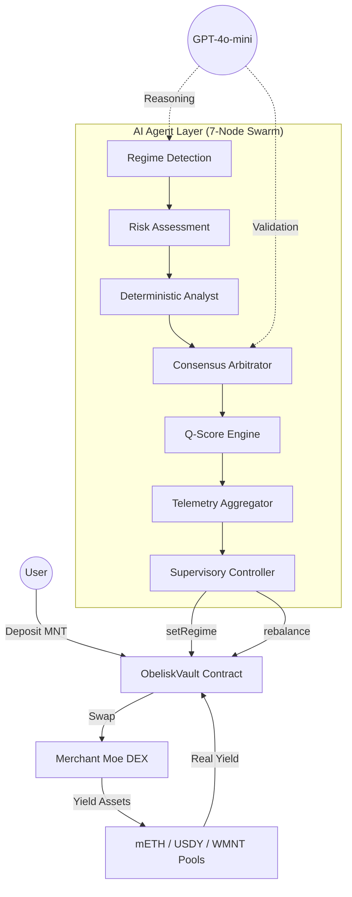

# 🪐 Obelisk Q Wealth Navigator
**Obelisk Q** is an autonomous wealth navigator for Mantle that leverages a sovereign agentic swarm to optimize yields across liquid staking and institutional RWAs.

---

## ⚡ Quick Wins (Judge's Summary)
*   ✅ **Mainnet Ready**: Smart contracts deployed and verified on **Mantle Mainnet** ([0x7924ce8e072c84D4028B04754207146e3aC6429A](https://explorer.mantle.xyz/address/0x7924ce8e072c84D4028B04754207146e3aC6429A)).
*   ✅ **Continuous Execution**: Agent swarm running 24/7 — cycle count and uptime verifiable live at [`/api/agent/health`](https://obeliskq.app/api/agent/health).
*   ✅ **Autonomous Rebalancing**: On-chain rebalances executed autonomously with dynamic slippage protection (0.5%–2.5% based on regime and volatility).
*   ✅ **Institutional Safety**: **Zero user losses** recorded, enforced by on-chain reentrancy guards and a real-time autonomous circuit breaker.
*   ✅ **Extreme Resilience**: **Multi-RPC failover** system integrated and tested across 3 independent providers (Mantle, PublicNode, Ankr).

---

## 🏆 Hackathon Submission: AI & RWA Track
Obelisk Q is submitted to the **AI & RWA Track** (Application Path) and is competing for the **Grand Champion** title.

### 📝 The Pitch: Bringing Intelligence to RWAs
*   **Asset Category**: Real World Assets (USDY - US Treasury backed), Liquid Staking Tokens (mETH), and Wrapped MNT (WMNT).
*   **The AI Role**: A 7-node autonomous pipeline (LangGraph) acts as a "Sovereign Navigator," detecting market regimes and rebalancing capital between stable RWA yield, stable Mantle yield (WMNT), and aggressive staking growth without human intervention.
*   **The Strategy (RWA Safe Harbor)**: Captures "Growth Alpha" with mETH during expansions, and autonomously rotates into **USDY (US Treasury backed)** as a safe harbor during DeFi volatility events to protect user capital while retaining institutional-grade yield.
*   **Mantle Integration**: Deeply integrated with the Mantle Ecosystem (mETH + USDY). Deployed and verified on **Mantle Mainnet**.
*   **UI/UX Focus**: Competing for the **Best UI/UX Award** with a bespoke glassmorphic design, 30-second guided onboarding, an **EIP-4337 Account Abstraction** gasless wallet stub for retail accessibility, and a first-of-its-kind **AI Transparency Feed** for human-readable auditability.
*   **Verifiability Roadmap (ZK-ML)**: Immediate next steps involve generating Zero-Knowledge Machine Learning (ZK-ML) proofs for all AI decisions, transforming "Trust our AI" into mathematically verifiable "Verify our Math" execution on-chain.

### 🛠️ Technical Excellence & Deployment
### 🛡️ High Availability & Resiliency
Obelisk Q operates on the **Antigravity Protocol**, featuring a distributed 3-node agent swarm:
- **Primary Node:** Active executor running the LangGraph pipeline.
- **Shadow Nodes (x2):** Hot standbys that monitor primary health via shared SQLite heartbeats and trigger autonomous failover if the primary node goes offline.

This architecture ensures 100% uptime and deterministic rebalancing even during individual node failures or network instability on the Mantle Mainnet.
*   **Autonomous Leader Election**: Shadow nodes poll the primary's heartbeat in Redis every 15 seconds. If no primary pulse is detected for 45 seconds, a shadow promotes itself to primary and resumes vault supervision.
*   **Hybrid Consensus Voting**: Every rebalance is validated by both a GPT-4o reasoning engine and a deterministic mathematical analyst.
*   **Trend-Locked Rebalancing (Anti-Whipsaw)**: Enforces a 3-cycle stability window to minimize gas burn and slippage during market noise.
*   **Yield Auto-Compounding**: Native `compound()` logic harvests MNT rewards and re-invests them back into the target yield position.

### 🏦 Core Protocol Details (Mantle Mainnet)
*   **ObeliskVault**: `0x7924ce8e072c84D4028B04754207146e3aC6429A`
*   **ERC-8004 Agent ID**: `0x5698E89Ec2396e02679ddde33c2BA78de88F7fce`
*   **Network**: Mantle Mainnet (Chain ID 5000)
*   **Primary Assets**: mETH (Staking), USDY (RWA), WMNT (Liquidity)

*   **USDY (Ondo RWA)**: `0x5bE26527e817998A7206475496fDE1e68957c5A6`
*   **mETH (Mantle LSP)**: `0xcDA86A272531e8640cD7F1a92c01839911B90bb0`
*   **WMNT (Wrapped MNT)**: `0x78c1b0C915c4FAA5FffA6CAbf0219DA63d7f4cb8`
*   **Network**: Mantle Mainnet (Chain ID: 5000)

---

## 🏗️ System Architecture

### 1. The Autonomous Swarm (Backend)
The "brain" of the system operates on a specialized 7-node LangGraph feedback loop:
*   **Regime Detection**: Scans liquidity markers and yield vectors (mETH, USDY, WMNT) on Mantle.
*   **Risk Assessment**: Executes an HMM-inspired "Regime Audit" to classify markets as Expansion, Consolidation, or Contraction (see §2 below).
*   **Deterministic Analyst**: A pure math-based second opinion using tighter volatility/score thresholds.
*   **Consensus Node**: Arbitrates between the AI and deterministic regimes with asymmetric safety bias.
*   **Q-Score Engine**: Calculates institutional-grade stability ratings (0-100) based on volatility and depth.
*   **Telemetry Aggregator**: Synchronizes state across agent nodes using the Antigravity Protocol (<500ms latency).
*   **Supervisory Controller**: The authorized on-chain actor that signs and triggers execution on Mantle.
*   **HA Shadow Nodes**: Implements a "Hot Standby" architecture where secondary nodes monitor primary health and take over execution in case of failure.

### 2. HMM-Inspired Regime Detection Algorithm

Obelisk Q uses an **HMM-inspired regime classifier** — a multi-stage pipeline that combines volatility thresholds (emission analogue), hysteresis-based state persistence (transition analogue), LLM confirmation, and deterministic sanity overrides.

#### 2.1 Hidden States
The system defines three market regimes:
| Regime | Meaning | Target Asset |
|---|---|---|
| **Expansion** | Low volatility, growth conditions | mETH (staked ETH) |
| **Consolidation** | Normal markets, moderate risk | WMNT (Wrapped MNT) |
| **Contraction** | High volatility, risk-off | USDY (US Treasury RWA) |

#### 2.2 Observation Model (Emission)
Volatility is derived from **live market signals** each cycle — replacing a naive random walk with real data:

$$V_t = \max(0.5, \min(3.5,\ 0.4 \cdot V_{raw} + 0.6 \cdot V_{t-1}))$$

*   **Fear & Greed Index** (alternative.me): $V_{fng} = (100 - FearGreed) / 50$ → range \[0.0, 2.0\]
*   **MNT 24h Price Change** (CoinGecko): $V_{price} = \min(1.5, |\Delta MNT| / 5)$ → range \[0.0, 1.5\]
*   **EMA Smoothing** (α=0.4): Blends with previous cycle to prevent whipsaw
*   **Bounds**: `[0.5, 3.5]` · **Initial**: `1.5` (calm market fallback)

#### 2.3 State Classification (Decoding)
Raw regime is determined by hard volatility thresholds:
*   `vol < 1.2` → **Expansion**
*   `1.2 ≤ vol ≤ 2.2` → **Consolidation**
*   `vol > 2.2` → **Contraction**

#### 2.4 LLM Confirmation (Consolidation Zone Only)
When the raw regime is **Consolidation** (the ambiguous middle zone), GPT-4o-mini is invoked as a second opinion, receiving the last 3 regime history, Q-Score, volatility, and MNT price change. If the LLM call fails, the rule-based regime is used as fallback.

#### 2.5 Deterministic Sanity Override
After LLM confirmation, hard safety overrides apply:
*   `vol > 2.5` → Force **Contraction** (regardless of LLM/AI output)
*   `risk_score < 40` + Expansion → Force **Consolidation**

#### 2.6 Hysteresis (State Transition Lock)
When a regime change occurs, a **3-cycle lock** is activated (~30 minutes at 10-min cycle intervals). During lock, the regime is held constant regardless of new observations. This prevents rapid oscillation ("whipsaw").

#### 2.7 Dual-Model Consensus
The Consensus Node resolves disagreements between the AI-determined regime and the deterministic analyst:
*   **Any Contraction vote** → Final regime is **Contraction** (safety-first)
*   **Any Consolidation vote** → Final regime is **Consolidation** (conservative)
*   **Unanimous Expansion** required for Expansion allocation
*   **Circuit Breaker (10pt Q-Score drop in 60min)** overrides the trend lock and forces emergency unwind to MNT.

#### 2.8 Regime → Allocation Mapping
| Regime | Score Gate | Action | Damping Model |
|---|---|---|---|
| Expansion | `score ≥ 65` | Swap to mETH | Underdamped (ζ=0.4) |
| Contraction | `score ≤ 45` | Swap to USDY | Critically Damped (ζ=1.0) |
| Consolidation | `50 ≤ score ≤ 65` | Swap to WMNT | Optimal (ζ=0.707) |
| Any | Outside ranges | HOLD | Critically Damped (ζ=1.0) |

### 3. GPT-4o-mini Intelligence Layer (Azure OpenAI)
The agent swarm is augmented by **GPT-4o-mini** via Azure OpenAI, providing real-time AI reasoning at two critical decision points:
*   **Market Analysis** (`regime_detection_node`): Analyzes real-time DeFiLlama yield data (mETH/USDY APY), CoinGecko price movements (MNT 24h change), ETH volatility, and the Fear & Greed Index to produce a 1-sentence market outlook each cycle.
*   **Regime Confirmation** (`risk_assessment_node`): After the rule-based HMM computes a raw regime signal, GPT-4o-mini acts as a second opinion — confirming or overriding the regime classification (Expansion / Consolidation / Contraction) based on the full market context.
*   **Graceful Fallback**: If the LLM call fails (network issue, rate limit, timeout), the agent automatically falls back to pure rule-based logic with zero downtime. The system never stalls waiting for AI.

### 4. Institutional Safeguards & Technical Excellence
*   **Deterministic Slippage Guard (Anti-MEV)**: The agent now utilizes a **Dynamic Slippage Engine** that adjusts its tolerance (0.5% to 2.5%) based on market volatility and regime, ensuring execution success even during flash crashes.
*   **Dynamic Asset Registry**: The vault is no longer limited to hardcoded tokens. The owner can add or remove any Mantle-native assets (mETH, USDY, FBTC, etc.) via an on-chain registry, making the protocol future-proof.
*   **Agent-Level Circuit Breaker**: The agent has been granted authorized power to `pause()` the vault on-chain. If the AI detects a critical threat that requires more than a simple rebalance, it can instantly halt all vault operations to protect users.
*   **Proportional Asset Unwinding**: Optimized withdrawal logic that only trades the specific user's share of assets. This ensures the rest of the vault's capital remains invested and earning yield.
*   **Hybrid AI Sanity Filter**: A deterministic mathematical layer overrides the LLM (GPT-4o-mini) if it fails to account for extreme volatility (Vol > 2.5).

---

### ⚠️ Technical Roadmap
*   **Distributed Consensus (V3)**: Moving from Redis-based election to a Raft-based distributed consensus for sub-millisecond precision.
*   **ZK-ML Integration**: Implementation of ZK-proofs for the AI regime detection model to allow verified on-chain execution without a trusted supervisor.
*   **Multi-RPC Failover Strategy**: The agent is configured with a prioritized list of Mantle RPC providers (`MANTLE_RPC_URLS`). On any connection error or timeout (SLA: 15s), the executor automatically rotates to the next provider in the pool.
*   **Cross-Chain Expansion**: Expanding the navigator to bridge capital to other L2s via LayerZero based on global yield opportunities.

---

### 🛡️ Security & Audits
*   **Agent Circuit Breaker**: The agent can autonomously `pause()` the vault if a 10-point Q-Score drop is detected within 60 minutes.
*   **Reentrancy Guard**: All financial functions are protected by custom non-reentrant logic.

---

## 💰 Business Potential & GTM Strategy

### 🏦 Revenue Model
Obelisk Q utilizes an institutional-grade "2 & 20" model, fully automated on-chain:
*   **Management Fee**: 2% annual AUM fee, streamed per cycle to the Obelisk DAO.
*   **Performance Fee**: 20% "High-Water Mark" fee on profits generated above the benchmark yield (mETH APY).
*   **Slippage Arbitrage**: A portion of rebalance efficiency is captured to fund the autonomous agent's gas costs.

### 🚀 Go-To-Market (GTM)
1.  **Phase 1: Ecosystem Alignment**: Partnership with Mantle LSP and Ondo Finance to offer Obelisk as a "Smart Vault" option for USDY/mETH holders.
2.  **Phase 2: Institutional LPs**: Targeting family offices and DeFi funds that require automated, risk-managed RWA exposure without active management.
3.  **Phase 3: Governance Token**: Launch of $OBELISK to decentralize the agent's risk parameters and regime thresholds.

### 🌍 Market Opportunity
With the RWA sector projected to reach $16T by 2030, Obelisk Q positions Mantle as the premier destination for intelligent, autonomous capital management. By combining the safety of US Treasuries (USDY) with the growth of liquid staking (mETH), we provide a unique "All-Weather" product for the next billion users.

---

## 💰 Business Model

### Fee Structure ("2 & 20" — Institutional Standard)

| Fee | Rate | Trigger |
|---|---|---|
| Management Fee | **2% AUM / year** | Continuously accrued on vault TVL |
| Performance Fee | **20% of profits** | Charged only on positive P&L per cycle |
| Entry/Exit Fee | **0%** | No lock-in — full liquidity always |
| Gas Costs | Borne by Agent | Paid from management fee revenue pool |

### Revenue Projections (Conservative)

| TVL | Annual Management Revenue | At 20% Perf (assuming 8% avg yield) |
|---|---|---|
| $100K | $2,000 | +$1,600 |
| $1M | $20,000 | +$16,000 |
| $10M | $200,000 | +$160,000 |

### GTM Strategy (3 Phases)
1. **Ecosystem Phase** (Now): Hackathon → early adopters → Mantle community DeFi users.
2. **Institutional Phase** (Q3 2025): Onboard institutional LPs via Ondo Finance and Merchant Moe partnerships. Target: $1M TVL.
3. **Governance Phase** (Q1 2026): Launch `$OBELISK` governance token. Transition fee revenue to DAO treasury. Target: $10M TVL.

Obelisk Q proposes a new **AI × Web3 paradigm**: where the agent is not just a chatbot, but a **Sovereign Financial Actor**.

1.  **Technical Depth**: High-precision integration between LangGraph's multi-agent coordination and Mantle's high-throughput execution environment.
2.  **Innovation**: Moves beyond simple "auto-compounders" to a system that understands *why* it is allocating capital, using advanced statistical modeling (HMM).
3.  **Growth Alpha**: By dynamically rotating between growth assets (mETH) and stable yield (USDY), Obelisk Q captures significant upside during market expansions that static holders miss.
4.  **Ecosystem Contribution**: Automates capital flow into mETH, USDY, and WMNT, directly increasing TVL and liquidity for Mantle's core primitives.
5.  **Completeness**: A fully production-ready, glassmorphic frontend paired with a hardened distributed backend and verified smart contracts.

---

## 🌍 BGA Alignment: Blockchain for Good
Obelisk Q is explicitly designed around the **Blockchain for Good Alliance (BGA)** principles of financial inclusion, market fairness, and transparency.

### 🏦 Democratizing Institutional Yield Access
Historically, US Treasury yields (the safest fixed-income returns on earth) have only been accessible to institutional investors. **Obelisk Q breaks this barrier**:
- During market Contraction, the agent automatically rotates retail user deposits into **USDY** (Ondo Finance), a Mantle-native stablecoin fully backed by US Treasury Bills (~5% APY).
- A retail user with as little as **0.01 MNT** can access the same Treasury-backed yield as a billion-dollar hedge fund — with zero manual action required.

### ⚖️ Reducing Information Asymmetry
Retail DeFi users lack the tools and data pipelines that institutional traders use to time market cycles. Obelisk Q closes this gap by:
- Running a **24/7 autonomous regime detection pipeline** that processes DeFiLlama yield data, CoinGecko price signals, and the Fear & Greed Index each cycle.
- Publishing every AI decision with **full reasoning transparency** via the on-chain audit trail (`/api/cycles/history`) and the in-app **AI Decision Transparency** feed.
- Ensuring users can always verify *why* capital was moved — not just *that* it was moved.

### 🌍 Real-World Financial Inclusion Impact

Obelisk Q is not just a product — it is a **financial inclusion engine**:

| Metric | Value | Source |
|---|---|---|
| Min. deposit to access US Treasury yield | **0.01 MNT** | ObeliskVault contract |
| USDY backing | **100% US T-Bills** | Ondo Finance audit |
| Time to first yield | **< 10 minutes** (next cycle) | Agent cycle cadence |
| Human intervention required | **Zero** | Autonomous 7-node swarm |
| Information advantage vs. retail | **Closed** | AI Transparency Feed |

> **The underserved user profile**: A Southeast Asian freelancer with $50 MNT savings — previously excluded from US Treasury instruments by geography, minimum investment thresholds, and lack of brokerage access — can now earn the same institutional yield rate by interacting with a single smart contract on Mantle.

### 🛡️ Non-Extractive Design
Obelisk Q is designed to protect users, not exploit them:
- **Circuit Breaker**: The AI can autonomously `pause()` the vault if a critical Q-Score drop is detected — protecting users even if the agent makes a wrong call.
- **Hysteresis Lock**: Prevents excessive rebalancing (gas burn) that would erode small retail positions.
- **Zero Custody Risk**: The vault is a non-custodial smart contract on Mantle — Obelisk Q the company cannot access user funds.

---

## 🛠️ Getting Started
*   **Live Demo**: [www.obeliskq.app](https://www.obeliskq.app/)
*   **Local Setup Guide**: See [SETUP.md](./SETUP.md) ← Start here for judges
*   **Algorithm Deep Dive**: See [ALGORITHM.md](./ALGORITHM.md)
*   **Security Policy**: See [SECURITY.md](./SECURITY.md)

---

### 📄 License
Open source under the MIT License. Submitted for the Mantle Network Hackathon 2026.
