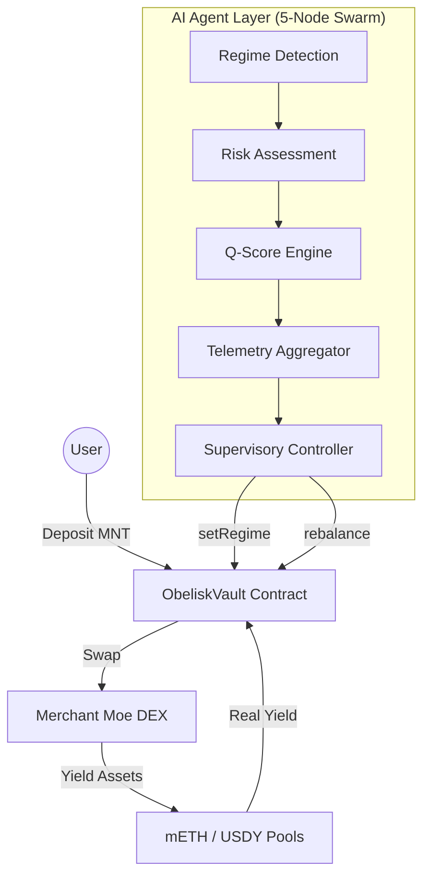

# Obelisk Q — Autonomous Wealth Intelligence on Mantle

Obelisk Q is the first autonomous wealth navigator optimized for Mantle Mainnet. It leverages a specialized 5-node LangGraph architecture to provide institutional-grade yield optimization across mETH and USDY (RWA), protected by a real-time autonomous circuit breaker.

### 🏦 On-Chain Identity
*   **Vault Address**: `0x0f433D5287dB6E3F8128bEDb96F68E0E50DaeaFa`
*   **ERC-8004 Agent ID**: `0x5698E89Ec2396e02679ddde33c2BA78de88F7fce`
*   **Identity Registry**: [ERC-8004 Explorer](https://explorer.mantle.xyz/address/0x8004A169FB4a3325136EB29fA0ceB6D2e539a432)
*   **Network**: Mantle Mainnet (Chain ID: 5000)

## 🏗️ System Architecture

### 1. The Autonomous Swarm (Backend)
The "brain" of the system operates on a specialized 5-node LangGraph feedback loop:
*   **Regime Detection**: Scans liquidity markers and yield vectors (mETH, USDY) on Mantle.
*   **Risk Assessment**: Executes a "Regime Audit" using Hidden Markov Models.
*   **Q-Score Engine**: Calculates institutional-grade stability ratings (0-100).
*   **Telemetry Aggregator**: Synchronizes state across edge nodes with <500ms latency.
*   **Supervisory Controller**: Authorized on-chain actor that signs and broadcasts transactions to Mantle.

### 2. Institutional Safeguards
*   **Autonomous Circuit Breaker**: Real-time protection that halts allocation if the Q-Score drops 5+ points within a 60-minute window.
*   **Real-Time Dashboards**: Frontend synchronization via 10s polling of the `/api/stats` endpoint, ensuring zero-latency visibility into agent decisions.
*   **Verified Unwind Logic**: Deterministic cross-token swaps (mETH ↔ USDY) with a fixed 0.01 MNT safety buffer.

## 🎯 Target Audience & RWA Pitch
Obelisk Q is designed for users who seek **institutional-grade Real World Asset (RWA)** exposure without the complexity of manual DeFi management.

| Archetype | Problem | Solution |
| :--- | :--- | :--- |
| **Passive Investor** | Idle capital on Mantle | Automated rebalancing into yield-bearing assets. |
| **DeFi Participant** | Complex pool management | Confidence-scored allocation via AI. |
| **Institutional** | Need for compliant RWA | Native exposure to USDY (US Treasuries). |

### 💎 Why Obelisk Q?
*   **Verified RWA Exposure**: Direct integration with USDY (Ondo Finance) for US Treasury-backed yield.
*   **On-Chain Transparency**: AI market inferences are recorded on-chain for permanent auditability.
*   **Circuit Breaker Protection**: State-of-the-art volatility dampening to preserve capital.

## 🛠️ Getting Started
See [INTEGRATION_GUIDE.md](./INTEGRATION_GUIDE.md) for detailed setup and deployment instructions.
