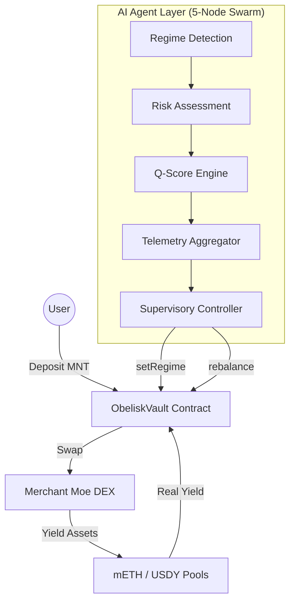

# Obelisk Q — Autonomous Wealth Intelligence on Mantle

**Obelisk Q** is the first autonomous wealth navigator optimized for Mantle Mainnet. It leverages a specialized 5-node LangGraph architecture to provide institutional-grade yield optimization across mETH and USDY (RWA), protected by a real-time autonomous circuit breaker.

---

## 🏆 Hackathon Submission: AI & RWA Track

Obelisk Q is submitted to the **AI & RWA Track** (Application Path) and is competing for the **Grand Champion** title.

### 📝 The Pitch: Bringing Intelligence to RWAs
*   **Asset Category**: Real World Assets (USDY - US Treasury backed) and Liquid Staking Tokens (mETH).
*   **The AI Role**: A 5-node autonomous swarm (LangGraph) acts as a "Sovereign Navigator," detecting market regimes and rebalancing capital between stable RWA yield and aggressive staking growth without human intervention.
*   **Mantle Integration**: Deeply integrated with the Mantle Ecosystem (mETH + USDY). Deployed and verified on **Mantle Mainnet**.

### 🛠️ Technical Excellence & Deployment
*   ✅ **Mantle Mainnet Deployment**: [0x0f433D5287dB6E3F8128bEDb96F68E0E50DaeaFa](https://explorer.mantle.xyz/address/0x0f433D5287dB6E3F8128bEDb96F68E0E50DaeaFa)
*   ✅ **Verified Contract**: Verified on Mantle Explorer with deterministic rebalance logic.
*   ✅ **On-Chain AI Execution**: The agent supervisor signs and broadcasts rebalance transactions directly to the vault based on its internal "Q-Score" inference.
*   ✅ **Sovereign Identity**: Integrated with the **ERC-8004** standard for autonomous agent identity on-chain.

---

### 🏦 Core Protocol Details
*   **Vault Address**: `0x0f433D5287dB6E3F8128bEDb96F68E0E50DaeaFa`
*   **ERC-8004 Agent ID**: `0x5698E89Ec2396e02679ddde33c2BA78de88F7fce`
*   **Network**: Mantle Mainnet (Chain ID: 5000)

---

## 🏗️ System Architecture

### 1. The Autonomous Swarm (Backend)
The "brain" of the system operates on a specialized 5-node LangGraph feedback loop:
*   **Regime Detection**: Scans liquidity markers and yield vectors (mETH, USDY) on Mantle.
*   **Risk Assessment**: Executes a "Regime Audit" using Hidden Markov Models to classify markets as Expansion, Consolidation, or Contraction.
*   **Q-Score Engine**: Calculates institutional-grade stability ratings (0-100) based on volatility and depth.
*   **Telemetry Aggregator**: Synchronizes state across agent nodes using the Antigravity Protocol (<500ms latency).
*   **Supervisory Controller**: The authorized on-chain actor that signs and triggers execution on Mantle.

### 2. Institutional Safeguards
*   **Autonomous Circuit Breaker**: Halts all capital allocation if the Q-Score drops 10 points within a 60-minute window.
*   **Real-Time Dashboards**: Premium UX with 10s telemetry polling, providing transparent visibility into the agent's logic.
*   **Verified Unwind Logic**: Deterministic cross-token swaps (mETH ↔ USDY) with a fixed safety buffer.

---

## 🎯 Innovation & Ecosystem Value

Obelisk Q proposes a new **AI × Web3 paradigm**: where the agent is not just a chatbot, but a **Sovereign Financial Actor**.

1.  **Technical Depth**: 30% of our focus is on the tight integration between LangGraph's multi-agent coordination and Mantle's high-throughput execution environment.
2.  **Innovation**: We move beyond simple "auto-compounders" to a system that understands *why* it is allocating capital, using advanced statistical modeling (HMM).
3.  **Ecosystem Contribution**: By automating the flow of capital into mETH and USDY, we increase the TVL and utility of Mantle's core yield assets.
4.  **Completeness**: A fully runnable, responsive, and institutional-grade frontend paired with a hardened backend and verified smart contracts.

---

## 🛠️ Getting Started
*   **Live Demo**: [obelisk-q.vercel.app](https://obelisk-q.vercel.app)
*   **Setup Instructions**: See [INTEGRATION_GUIDE.md](./INTEGRATION_GUIDE.md)
*   **Architecture Deep Dive**: See [src/pages/Docs.tsx](./src/pages/Docs.tsx)

---

### 📄 License
Open source under the MIT License. Submitted for the Mantle Network Hackathon 2026.
