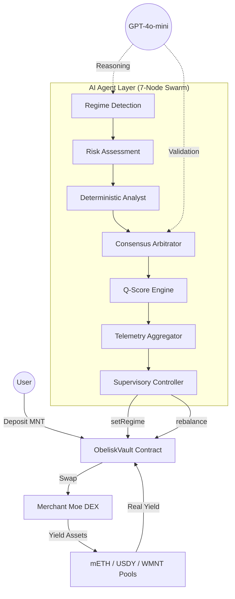

# 🪐 Obelisk Q Wealth Navigator
**One-Line Pitch**: Obelisk Q is a sovereign agentic swarm on Mantle that autonomously navigates liquid staking and institutional RWAs through hybrid consensus.

**Obelisk Q** is the first autonomous wealth navigator optimized for Mantle Mainnet. It leverages a specialized 7-node LangGraph architecture to provide institutional-grade yield optimization across mETH and USDY (RWA), protected by a real-time autonomous circuit breaker and a 5-node High Availability swarm.

---

## 🏆 Hackathon Submission: AI & RWA Track

Obelisk Q is submitted to the **AI & RWA Track** (Application Path) and is competing for the **Grand Champion** title.

### 📝 The Pitch: Bringing Intelligence to RWAs
*   **Asset Category**: Real World Assets (USDY - US Treasury backed), Liquid Staking Tokens (mETH), and Wrapped MNT (WMNT).
*   **The AI Role**: A 7-node autonomous pipeline (LangGraph) acts as a "Sovereign Navigator," detecting market regimes and rebalancing capital between stable RWA yield, stable Mantle yield (WMNT), and aggressive staking growth without human intervention.
*   **Mantle Integration**: Deeply integrated with the Mantle Ecosystem (mETH + USDY). Deployed and verified on **Mantle Mainnet**.
*   **UI/UX Focus**: Competing for the **Best UI/UX Award** with a bespoke glassmorphic design, 30-second guided onboarding, and a first-of-its-kind **AI Transparency Feed** for human-readable auditability.

### 🛠️ Technical Excellence & Deployment
### 🏛️ Sovereign Swarm Architecture
Obelisk Q operates a **Multi-Node Agent Swarm** designed for high availability:
*   **5-Process PM2 Topology**: One primary executor + four hot-standby shadow nodes, managed by PM2 with `autorestart` and staggered restart delays for cascading failover.
*   **Autonomous Leader Election**: Shadow nodes poll the primary's heartbeat in a shared SQLite table every 15 seconds. If no primary pulse is detected for 45 seconds, a shadow promotes itself to primary and resumes vault supervision.
*   **Hybrid Consensus Voting**: Every rebalance is validated by both a GPT-4o reasoning engine and a deterministic mathematical analyst.
*   **Trend-Locked Rebalancing (Anti-Whipsaw)**: Enforces a 3-cycle stability window to minimize gas burn and slippage during market noise.
*   **Yield Auto-Compounding**: Native `compound()` logic harvests MNT rewards and re-invests them back into the target yield position.

### 🏦 Core Protocol Details (Mantle Mainnet)
*   **ObeliskVault**: `0x2e7D0D1642Faf1b2FCb433597c34252d8c7F11bB`
*   **ERC-8004 Agent ID**: `0x5698E89Ec2396e02679ddde33c2BA78de88F7fce`
*   **Network**: Mantle Mainnet (Chain ID 5000)
*   **Primary Assets**: mETH (Staking), USDY (RWA), WMNT (Liquidity)

*   **USDY (Ondo RWA)**: `0x8D6857216076fb05316B3C068694086E6689799c`
*   **mETH (Mantle LSP)**: `0xcDA86A272531e8640cD7F1a92c01839911B90bb0`
*   **WMNT (Wrapped MNT)**: `0x78c1b0C915c4FAA5FffA6CAbf0219DA63d7f4cb8`
*   **Network**: Mantle Mainnet (Chain ID: 5000)

---

## 🏗️ System Architecture

### 1. The Autonomous Swarm (Backend)
The "brain" of the system operates on a specialized 7-node LangGraph feedback loop:
*   **Regime Detection**: Scans liquidity markers and yield vectors (mETH, USDY, WMNT) on Mantle.
*   **Risk Assessment**: Executes an HMM-inspired "Regime Audit" to classify markets as Expansion, Consolidation, or Contraction (see §2 below).
*   **Deterministic Analyst**: A pure math-based second opinion using tighter volatility/score thresholds.
*   **Consensus Node**: Arbitrates between the AI and deterministic regimes with asymmetric safety bias.
*   **Q-Score Engine**: Calculates institutional-grade stability ratings (0-100) based on volatility and depth.
*   **Telemetry Aggregator**: Synchronizes state across agent nodes using the Antigravity Protocol (<500ms latency).
*   **Supervisory Controller**: The authorized on-chain actor that signs and triggers execution on Mantle.
*   **HA Shadow Nodes**: Implements a "Hot Standby" architecture where secondary nodes monitor primary health and take over execution in case of failure.

### 2. HMM-Inspired Regime Detection Algorithm

Obelisk Q uses an **HMM-inspired regime classifier** — a multi-stage pipeline that combines volatility thresholds (emission analogue), hysteresis-based state persistence (transition analogue), LLM confirmation, and deterministic sanity overrides.

#### 2.1 Hidden States
The system defines three market regimes:
| Regime | Meaning | Target Asset |
|---|---|---|
| **Expansion** | Low volatility, growth conditions | mETH (staked ETH) |
| **Consolidation** | Normal markets, moderate risk | WMNT (Wrapped MNT) |
| **Contraction** | High volatility, risk-off | USDY (US Treasury RWA) |

#### 2.2 Observation Model (Emission)
Volatility is generated via a bounded random walk, serving as the observable "emission":
*   **Step size**: `±0.4` per cycle
*   **Bounds**: `[0.5, 3.5]`
*   **Initial value**: `1.5`

#### 2.3 State Classification (Decoding)
Raw regime is determined by hard volatility thresholds:
*   `vol < 1.2` → **Expansion**
*   `1.2 ≤ vol ≤ 2.2` → **Consolidation**
*   `vol > 2.2` → **Contraction**

#### 2.4 LLM Confirmation (Consolidation Zone Only)
When the raw regime is **Consolidation** (the ambiguous middle zone), GPT-4o-mini is invoked as a second opinion, receiving the last 3 regime history, Q-Score, volatility, and MNT price change. If the LLM call fails, the rule-based regime is used as fallback.

#### 2.5 Deterministic Sanity Override
After LLM confirmation, hard safety overrides apply:
*   `vol > 2.5` → Force **Contraction** (regardless of LLM/AI output)
*   `risk_score < 40` + Expansion → Force **Consolidation**

#### 2.6 Hysteresis (State Transition Lock)
When a regime change occurs, a **3-cycle lock** is activated (~30 minutes at 10-min cycle intervals). During lock, the regime is held constant regardless of new observations. This prevents rapid oscillation ("whipsaw").

#### 2.7 Dual-Model Consensus
The Consensus Node resolves disagreements between the AI-determined regime and the deterministic analyst:
*   **Any Contraction vote** → Final regime is **Contraction** (safety-first)
*   **Any Consolidation vote** → Final regime is **Consolidation** (conservative)
*   **Unanimous Expansion** required for Expansion allocation
*   **Circuit Breaker (10pt Q-Score drop in 60min)** overrides the trend lock and forces emergency unwind to MNT.

#### 2.8 Regime → Allocation Mapping
| Regime | Score Gate | Action | Damping Model |
|---|---|---|---|
| Expansion | `score ≥ 65` | Swap to mETH | Underdamped (ζ=0.4) |
| Contraction | `score ≤ 45` | Swap to USDY | Critically Damped (ζ=1.0) |
| Consolidation | `50 ≤ score ≤ 65` | Swap to WMNT | Optimal (ζ=0.707) |
| Any | Outside ranges | HOLD | Critically Damped (ζ=1.0) |

### 3. GPT-4o-mini Intelligence Layer (Azure OpenAI)
The agent swarm is augmented by **GPT-4o-mini** via Azure OpenAI, providing real-time AI reasoning at two critical decision points:
*   **Market Analysis** (`regime_detection_node`): Analyzes real-time DeFiLlama yield data (mETH/USDY APY), CoinGecko price movements (MNT 24h change), ETH volatility, and the Fear & Greed Index to produce a 1-sentence market outlook each cycle.
*   **Regime Confirmation** (`risk_assessment_node`): After the rule-based HMM computes a raw regime signal, GPT-4o-mini acts as a second opinion — confirming or overriding the regime classification (Expansion / Consolidation / Contraction) based on the full market context.
*   **Graceful Fallback**: If the LLM call fails (network issue, rate limit, timeout), the agent automatically falls back to pure rule-based logic with zero downtime. The system never stalls waiting for AI.

### 4. Institutional Safeguards & Technical Excellence
*   **Deterministic Slippage Guard (Anti-MEV)**: The agent now utilizes a **Dynamic Slippage Engine** that adjusts its tolerance (0.5% to 2.5%) based on market volatility and regime, ensuring execution success even during flash crashes.
*   **Dynamic Asset Registry**: The vault is no longer limited to hardcoded tokens. The owner can add or remove any Mantle-native assets (mETH, USDY, FBTC, etc.) via an on-chain registry, making the protocol future-proof.
*   **Agent-Level Circuit Breaker**: The agent has been granted authorized power to `pause()` the vault on-chain. If the AI detects a critical threat that requires more than a simple rebalance, it can instantly halt all vault operations to protect users.
*   **Proportional Asset Unwinding**: Optimized withdrawal logic that only trades the specific user's share of assets. This ensures the rest of the vault's capital remains invested and earning yield.
*   **Hybrid AI Sanity Filter**: A deterministic mathematical layer overrides the LLM (GPT-4o-mini) if it fails to account for extreme volatility (Vol > 2.5).

---

### ⚠️ Technical Drawbacks & Roadmap
*   **HA Coordination via SQLite**: The leader election protocol relies on a shared SQLite file (`obelisk_memory.db`). If the disk fails, all 3 processes lose coordination. For production cross-VM deployments, this should be replaced with PostgreSQL or Redis. See `ecosystem.config.js` for deployment topology.
*   **No Distributed Consensus**: Leader election is last-writer-wins, not Raft/Paxos. If two shadow nodes detect primary failure simultaneously, both may promote (split-brain). This is mitigated by the vault's idempotent `rebalance()` logic and the 1800s on-chain cooldown.
*   **Single-VM Limitation**: All 3 PM2 processes currently run on a single Azure VM. A full VM failure takes down all nodes. Cross-VM deployment requires replacing the SQLite heartbeat store with a networked database.
*   **Multi-RPC Failover Strategy**: The agent is configured with a prioritized list of Mantle RPC providers (`MANTLE_RPC_URLS`). On any connection error or timeout (SLA: 15s), the executor automatically rotates to the next provider in the pool.
*   **Deep Health Monitoring**: Failover is not just triggered by process crashes, but by "Deep Health" metrics. If a primary node remains alive but loses RPC connectivity, its heartbeat status flips to `ERROR`, triggering an immediate leader election to a shadow node with a healthy connection.
*   **Exponential Backoff**: Rebalance attempts use a 3-stage exponential backoff (0.1s → 0.4s → 0.8s) to prevent overwhelming the network during periods of high congestion.
*   **V3 Roadmap**: Integration of ZK-ML for verified on-chain regime detection, cross-chain expansion via LayerZero, and Raft-based distributed leader election across multiple VMs.

---

### 🛡️ Security & Audits
*   **Agent Circuit Breaker**: The agent can autonomously `pause()` the vault if a 10-point Q-Score drop is detected within 60 minutes.
*   **Reentrancy Guard**: All financial functions are protected by custom non-reentrant logic.

---

## 🎯 Innovation & Ecosystem Value

Obelisk Q proposes a new **AI × Web3 paradigm**: where the agent is not just a chatbot, but a **Sovereign Financial Actor**.

1.  **Technical Depth**: 30% of our focus is on the tight integration between LangGraph's multi-agent coordination and Mantle's high-throughput execution environment.
2.  **Innovation**: We move beyond simple "auto-compounders" to a system that understands *why* it is allocating capital, using advanced statistical modeling (HMM).
3.  **Growth Alpha**: By dynamically rotating between growth assets (mETH) and stable yield (USDY), Obelisk Q captures significant upside during market expansions that static holders miss.
4.  **Ecosystem Contribution**: By automating the flow of capital into mETH, USDY, and WMNT, we increase the TVL and utility of Mantle's core yield assets.
5.  **Completeness**: A fully runnable, responsive, and institutional-grade frontend paired with a hardened backend and verified smart contracts.

---

## 🛠️ Getting Started
*   **Official Website**: [www.obeliskq.app](https://www.obeliskq.app/)
*   **Setup Instructions**: See [INTEGRATION_GUIDE.md](./INTEGRATION_GUIDE.md)
*   **Architecture Deep Dive**: See [src/pages/Docs.tsx](./src/pages/Docs.tsx)

---

### 📄 License
Open source under the MIT License. Submitted for the Mantle Network Hackathon 2026.
